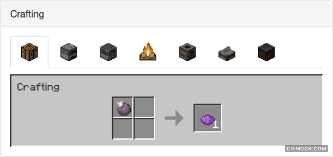

# MCCrafting
Purpose to come!

## Installation
Installation of this collection of recipes can be accomplished by simply cloning
the repo and running the `unpack.sh` shell script, passing it the directory of
your world's datapacks directory. (i.e., `./unpack.sh ~/server/world/datapacks`)

This command will copy the needed contents of this recipe collection to your
datapacks directory and deletes the cloned directory after installation. After
this is complete, simply restarting your world or using the `/reload` command
will update your datapacks.

## Updates
This recipe collection will receive periodic updates. To install these updates,
the `update_recipes.sh` shell script can be called from inside your world's
datapacks directory. This will automatically follow the installation process as
described above, getting you the latest changes.

**NOTE:** Updating this recipe collection still requires you to restart or
reload your world to update the world's datapacks.

## Definitions
**Shapeless**: A shapeless recipe means that you can place the items required
to craft the recipe anywhere in your crafting menu to obtain craft the item(s)
listed. These recipes are noted in this README in the following format: 
***Recipe Name (Shapeless)***

## Recipes
This Minecraft datapack includes several quality-of-life recipes that have been
broken up into the groups listed below.

### Alternate Crafting
Alternate (potentially better) recipes for crafting in-game items.

Better Trapdoors 

The default recipes for crafting trapdoors now produce 12 wooden or 6 iron 
trapdoors. **NOTE:** This recipe does not currently work for crimson and warped
trapdoors (this seems to be a bug in 1.18).

 

### Back to Blocks
These recipes allow you to convert crafted items back into their full block 
form. These recipes work with ALL variants (i.e., acaia, stone, crimson, etc.).

Slabs

Stairs

 

### Cooking
These recipes present expanded options for cooking items.

Rotten Flesh to Leather

Rotten Flesh to Porkchop (Works in furnace and smoker)

 

### Custom Craftables
At the time of writing, there is currently no way to craft the items in this section.

Spore Blossom

Sponge (works with any wool and any coral (1 sponge) or coral block (9 sponge))

Crying Obsidian

Moss Block

Nametag

Saddle

Gilded Blackstone (Shapeless)

 

### Dyes
These recipes encompass alternate ways to get different dyes.

Charcoal or Coal to Black Dye

Chorus Fruit to Purple Dye

Green Dye Alternative

Lime Dye Alternative

 

### Expanded Crafting
These recipes are improvements on recipes that already exist in-game.

Dripstone Spikes

Dropper to Dispenser

Magma Crean to Slimeball

Redyeable Items

All dyed candles, carpet, concrete powder, glass, glass panes, terracotta, and
wool can now be redyed to a different color.

 

### Packables
These recipes allow you to pack components into their condensed form and vice-versa.

Blue Ice -> Packed Ice -> Ice

Flint to Gravel

Quartz Block to Quartz

Sand to Sandstone

Sandstone to Sand

White Wool to String

 
